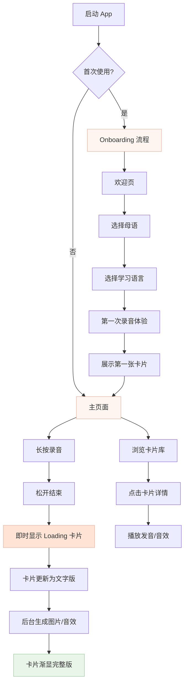

---

# 🎙️ VoxWords 场景词汇捕手 - 完整产品规划 (iOS Native)

## 一、产品概述

### 1.1 产品定位

一款面向亲子场景的语言学习 iOS app，通过**快速语音录制**捕捉日常生活中的语言学习时刻，利用 iOS 原生 AI 能力即时解析，生成**沉浸式学习卡片**。

### 1.2 核心价值

- **即时性**：利用 iOS 原生语音识别，毫秒级响应
- **沉浸感**：AI 生成的场景图片 + 拟声音效
- **亲子共创**：记录每一个学习时刻的场景

### 1.3 目标用户

- 3-10 岁儿童的家长
- 希望在日常场景中进行语言启蒙

---

## 二、iOS 原生技术架构

### 2.1 技术栈

| 能力 | iOS 原生方案 | 优势 |
| --- | --- | --- |
| **语音识别** | `SFSpeechRecognizer` | 本地处理、毫秒响应、支持多语言 |
| **语言检测** | `NLLanguageRecognizer` | 自动识别输入语言 |
| **文本发音** | `AVSpeechSynthesizer` | 本地 TTS、多语言支持 |
| **AI 词汇提取** | 云端 API (Lovable AI / OpenAI) | 语义理解需要 LLM |
| **图片生成** | 云端 API (异步) | 后台生成、渐显更新 |
| **音效生成** | 云端 API (异步) | 后台生成 |
| **数据存储** | Core Data / CloudKit | 本地优先、iCloud 同步 |

### 2.2 混合架构流程

```
用户录音 → iOS 本地语音识别（即时）
         ↓
    提取文本 → 云端 AI 词汇解析（1-2s）
         ↓
    即时生成卡片（文字版）← iOS 本地 TTS
         ↓
    后台异步：AI 生成图片 + 音效
         ↓
    卡片渐显更新为完整版

```

---

## 三、用户流程

### 3.1 整体流程图



---

## 四、Onboarding 设计

### 4.1 流程（5 步）


### 4.2 各步骤详情

### Step 1: 欢迎页

- **内容**：品牌 Logo + 欢迎语
- **文案**：「捕捉每一个学习时刻」
- **交互**：点击「开始」继续

### Step 2: 母语选择

- **标题**：「你说什么语言？」
- **副标题**：「这是你和孩子的日常语言」
- **选项**：卡片式语言选择（中文、English、日本語、한국어）
- **设计**：2x2 网格，点选高亮

### Step 3: 学习语言选择

- **标题**：「想学什么语言？」
- **副标题**：「我们会用这个语言生成卡片」
- **选项**：同上，但排除已选的母语
- **设计**：支持多选（未来扩展）

### Step 4: 首次录音体验

- **标题**：「来试试吧！」
- **副标题**：「长按下方按钮，问一个问题」
- **提示气泡**：「试试说：狮子用英语怎么说？」
- **交互**：长按录音按钮

### Step 5: 展示第一张卡片

- **动画**：卡片从下方弹入
- **内容**：生成的第一张卡片
- **按钮**：「开始使用」

---

## 五、主页面设计

### 5.1 页面布局

```
┌─────────────────────────────────┐
│  今天           ← 日期          │
│  3 张卡片       ← 统计          │
├─────────────────────────────────┤
│                                 │
│  ┌─────┐ ┌─────┐ ┌─────┐       │
│  │     │ │     │ │     │       │
│  │ 卡片 │ │ 卡片 │ │ 卡片 │       │
│  │     │ │     │ │     │       │
│  └─────┘ └─────┘ └─────┘       │
│                                 │
│  ┌─────┐ ┌─────┐               │
│  │     │ │     │               │
│  │ 卡片 │ │ 卡片 │ ← 瀑布流网格   │
│  │     │ │     │               │
│  └─────┘ └─────┘               │
│                                 │
├─────────────────────────────────┤
│                                 │
│         ⭕ 录音按钮              │
│                                 │
└─────────────────────────────────┘

```

### 5.2 组件规范

### Header

- **左侧**：日期（「今天」/「12月7日」）
- **右侧**：卡片数量（「3 张卡片」）
- **样式**：SF Pro Display, 28pt, 深灰色

### 卡片网格

- **布局**：2 列瀑布流
- **间距**：12pt
- **圆角**：20pt
- **阴影**：0 4pt 12pt rgba(0,0,0,0.08)

### 录音按钮

- **尺寸**：80pt × 80pt
- **颜色**：渐变粉（#FFB4A2 → #FFCDB2）
- **图标**：SF Symbol `mic.fill`
- **状态**：
    - 默认：静止
    - 按下：放大 1.1x + 脉冲动画
    - 录音中：声波动画

---

## 六、卡片设计

### 6.1 卡片状态

stateDiagram-v2
[*] --> Loading: 开始处理
Loading --> TextOnly: 文字提取完成
TextOnly --> ImageLoading: 开始生成图片
ImageLoading --> Complete: 图片生成完成

```
Loading: 🔄 骨架屏动画
TextOnly: 📝 文字 + 占位图
ImageLoading: 🖼️ 图片加载中
Complete: ✅ 完整卡片

```

### 6.2 卡片布局（紧凑版 - 网格展示）

```
┌───────────────────────┐
│                       │
│    [AI 生成图片]       │
│    或 [占位渐变]       │
│                       │
├───────────────────────┤
│  Lion                 │  ← 单词 (SF Pro, 20pt, Bold)
│  狮子                  │  ← 翻译 (SF Pro, 14pt, Gray)
└───────────────────────┘

```

### 6.3 卡片布局（详情版 - 弹窗展示）

```
┌─────────────────────────────────┐
│                                 │
│                                 │
│        [AI 生成大图]            │
│                                 │
│                                 │
├─────────────────────────────────┤
│                                 │
│   Lion            🔊 ▶️ 🎵      │
│   狮子             发音  音效    │
│                                 │
│   ─────────────────────────     │
│                                 │
│   📍 在动物园问的                │
│   🏷️ 动物                       │
│   📅 2024.12.7                  │
│                                 │
└─────────────────────────────────┘

```

### 6.4 占位图设计

- **风格**：柔和渐变 + 微动画
- **颜色**：与卡片主题色一致
- **动画**：Shimmer 光效扫过

---

## 七、动画规范

### 7.1 核心动画

| 场景 | 动画类型 | 时长 | 曲线 |
| --- | --- | --- | --- |
| 页面切换 | iOS 标准 Push | 0.35s | easeInOut |
| 卡片出现 | Scale + Fade | 0.3s | spring(0.6, 0.8) |
| 卡片点击 | Scale Down | 0.1s | easeOut |
| 图片渐显 | Fade In | 0.4s | easeIn |
| 录音按钮按下 | Scale Up + 脉冲 | 持续 | linear |
| Loading 状态 | Shimmer | 1.5s | linear, repeat |

### 7.2 录音按钮动画

```swift
// 按下状态
withAnimation(.spring(response: 0.3, dampingFraction: 0.6)) {
    scale = 1.15
    isRecording = true
}

// 声波动画
ForEach(0..<3) { i in
    Circle()
        .stroke(Color.pink.opacity(0.3))
        .scaleEffect(waveScale[i])
        .animation(.easeOut(duration: 1).repeatForever().delay(Double(i) * 0.2))
}

```

### 7.3 卡片图片渐显

```swift
// 图片从模糊到清晰
Image(card.imageURL)
    .blur(radius: isLoaded ? 0 : 10)
    .opacity(isLoaded ? 1 : 0.3)
    .animation(.easeIn(duration: 0.4), value: isLoaded)

```

---

## 八、颜色规范

### 8.1 主色调（Capwords 风格）

| 名称 | Hex | 用途 |
| --- | --- | --- |
| Warm Cream | `#FFF5F0` | 背景色 |
| Soft Pink | `#FFCDB2` | 主强调色 |
| Warm Peach | `#FFB4A2` | 按钮渐变 |
| Dusty Rose | `#E5989B` | 次要强调 |
| Sage Green | `#B5C9A8` | 成功状态 |
| Warm Gray | `#8B7E74` | 文字颜色 |
| Deep Brown | `#4A3F35` | 标题颜色 |

### 8.2 语义颜色

| 状态 | 颜色 | 用途 |
| --- | --- | --- |
| 录音中 | `#FFB4A2` | 按钮脉冲 |
| 加载中 | `#E8E4E0` | 骨架屏 |
| 成功 | `#B5C9A8` | 完成提示 |
| 错误 | `#E5989B` | 错误提示 |

---

## 九、数据模型

### 9.1 VocabularyCard

```swift
struct VocabularyCard: Identifiable, Codable {
    let id: UUID
    var word: String           // 目标语言单词
    var translation: String    // 母语翻译
    var language: String       // 目标语言代码 (en/ja/ko)
    var imageURL: URL?         // AI 生成图片 URL
    var audioURL: URL?         // TTS 发音 URL
    var soundEffectURL: URL?   // 拟声音效 URL
    var sceneNote: String?     // 场景备注
    var category: String?      // 分类 (动物/食物/交通等)
    var status: CardStatus     // 卡片状态
    let createdAt: Date

    enum CardStatus: String, Codable {
        case loading           // 正在处理
        case textOnly          // 仅文字
        case imageLoading      // 图片生成中
        case complete          // 完整
    }
}

```

### 9.2 UserPreferences

```swift
struct UserPreferences: Codable {
    var nativeLanguage: String    // 母语代码
    var targetLanguage: String    // 学习语言代码
    var hasCompletedOnboarding: Bool
}

```

---

## 十、API 接口

### 10.1 词汇提取 API

```
POST /api/extract-vocabulary
Body: { "transcript": "狮子用英语怎么说", "targetLanguage": "en" }
Response: {
    "word": "Lion",
    "translation": "狮子",
    "category": "动物",
    "sceneNote": "在询问动物名称"
}

```

### 10.2 图片生成 API

```
POST /api/generate-image
Body: { "word": "Lion", "category": "动物" }
Response: { "imageUrl": "https://..." }

```

### 10.3 音效生成 API

```
POST /api/generate-sound-effect
Body: { "word": "Lion", "category": "动物" }
Response: { "audioUrl": "https://..." }

```

---

## 十一、MVP 范围

### ✅ 第一版包含

- [x]  完整 Onboarding（语言选择 + 首次体验）
- [x]  iOS 原生语音识别（SFSpeechRecognizer）
- [x]  iOS 原生 TTS（AVSpeechSynthesizer）
- [x]  云端 AI 词汇提取
- [x]  云端 AI 图片生成（异步）
- [x]  云端 AI 音效生成（异步）
- [x]  卡片网格展示
- [x]  卡片详情弹窗
- [x]  本地数据存储（Core Data）

### ⏳ 后续迭代

- [ ]  iCloud 同步
- [ ]  多语言切换
- [ ]  卡片复习系统（间隔复习）
- [ ]  学习统计
- [ ]  Widget 小组件
- [ ]  Siri Shortcuts 集成

---

这份文档涵盖了产品规划、技术架构、用户流程、UI/UX 设计规范、动画规范、颜色系统和数据模型。你可以直接用于 Swift 开发参考。